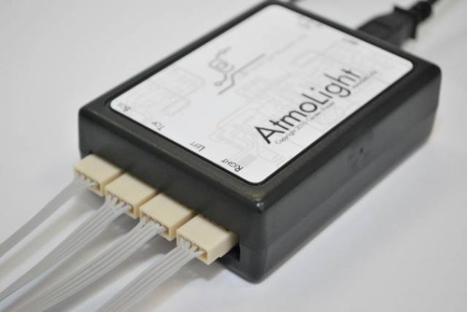

# AtmoLin
A personal project from ~2013 to control the Atmolights in my home theater on Linux, hence the "Lin" in AtmoLin. However, it also works on Windows. 

## Atmolight
The device is out of production. There are better alternatives now (e.g., addressable LED Stripes with WLED). 

